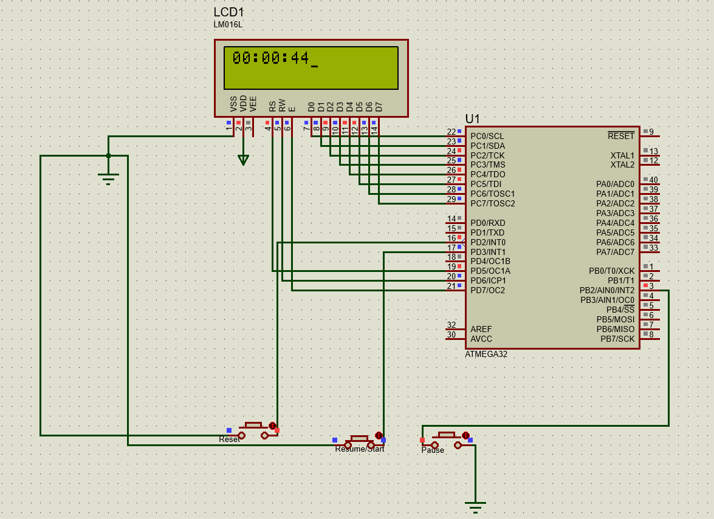

### Stop-Watch
Implementation of a stopwatch project using AVR Atmega32 and push buttons and Character LCD
the peripherals used:
- GPIO
- Timer
- External interrupt

here's a simulation of the project

  

